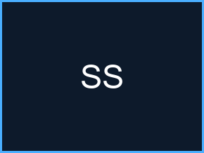

  
  <h1>ShopScheduleRoku</h1>
  
A native Roku kiosk client for <a href="https://github.com/i-machine-things/shop-schedule">shop-schedule</a> — displays the shop floor schedule on a wall-mounted TV via a Roku device.

---

## 📖 Learn More

[**shop-schedule**](https://github.com/i-machine-things/shop-schedule) is a Single Board Computer kiosk that pulls the current Foreman's Report (from JobBoss directly, or via a Gmail/PDF fallback) and serves it as an auto-scrolling web page. **ShopScheduleRoku** is an alternative display target for the same data — instead of a Banana Pi running Chromium in kiosk mode, point a Roku at the same server.

Roku's public SDK has no web-view/embedded-browser component, so this channel can't just display `kiosk.html` directly. It polls a small JSON export (`/schedule.json`) that `shop-schedule`'s server exposes alongside the HTML pages, and renders the table natively in BrightScript — same data, same grouping (Department → WC Group → WC), same overdue-date highlighting, continuously auto-scrolling.

### ✨ Features
* **Native auto-scrolling display** grouped by work center, matching the web kiosk's layout and color scheme.
* **Overdue jobs highlighted** in red, same as the web version.
* **Resilient to network blips** — a failed poll shows a small warning banner without blanking the last good schedule.
* **One-time setup** — enter the server address once; it's remembered in the Roku's registry.

---

## 🚀 Installation & Sideloading

This is an internal/unofficial channel — it must be sideloaded.

### Step 1: Enable Developer Mode on your Roku
On the Roku remote, enter this sequence rapidly:
1. **Home** (x3)
2. **Up** (x2)
3. **Right** → **Left** → **Right** → **Left** → **Right**

Follow the prompts to enable Developer Mode. It will give you a webserver **password** — write it down along with the Roku's **IP address**.

### Step 2: Download the App
Grab the latest `shop-schedule-roku-vX.Y.Z.zip` from the [Releases](../../releases) tab (or build it from source — see CI's build job).

### Step 3: Install the App
1. On a computer/phone on the same network, go to `http://<roku-ip>` in a browser.
2. Log in with username `rokudev` and the password from Step 1.
3. **Upload** the zip, then **Install**.

The app launches immediately.

---

## ⚙️ Configuration

On first launch, you'll be asked for the `shop-schedule` server's address — e.g. `http://192.168.1.65:8080` (the same address you'd use to view `kiosk.html` in a browser). Press OK on the field to open the on-screen keyboard. Once saved, the schedule loads automatically and keeps refreshing (every 60 seconds) from then on, every time the channel launches.

To point the kiosk at a different server later, press **Options (\*)** on the remote while the schedule is showing — this clears the saved address and returns to setup. Not advertised anywhere in the UI on purpose (this runs unattended on a shop floor TV).

---

## ⚖️ Legal & Privacy

Internal tool. Does not collect, store, or transmit any telemetry — all communication is between the Roku device and your own `shop-schedule` server. Not officially affiliated with Roku Inc.
